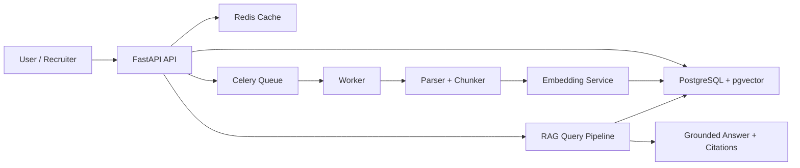

# Architecture Diagram

Use this diagram in the repository, portfolio, or LinkedIn post to explain the
backend-first design at a glance.

## Diagram

## One-Line Caption

`Backend-first RAG architecture with async ingestion, vector retrieval, and citation-backed grounded answers.`

## How To Explain It In 20 Seconds

> The API accepts uploads and queries, Redis backs caching and queueing, a Celery worker handles ingestion, PostgreSQL + pgvector stores chunks and vectors, and the query pipeline returns grounded answers with source citations.

## What Makes This Architecture Strong

- Uploads stay lightweight because ingestion runs asynchronously
- Retrieval and grounding are explicit backend services, not hidden inside one prompt
- Postgres stores both operational metadata and vector search state
- Redis supports both hot-query caching and background job delivery
- The answer path is designed to reject low-confidence unsupported responses

## Best Use In Public Showcase

Use this diagram:

- in the GitHub README
- in a LinkedIn carousel
- in a portfolio case study
- as the final frame of the demo video
